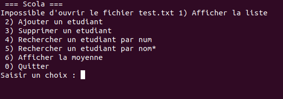

#  Gestionnaire d'étudiants
## Informations générale

    Cette application, développé en C
    github pages: https://ahmedroumili.github.io/etudiant/
## Fonctionnalités
    Affichage de la liste des étudiants
    Ajouter un étudiant
    Rechercher un étudiant
    Supprimer un étudiant
    Afficher la moyenne d'un étudiant
    

## Compilation

    commandes bash:
        gcc -I./include/ -Wall src/main.c src/appli.c src/etud.c -o etud

    makefile:
        make
    
## Execution
    ./etud

## Auteurs
    ROUMILI Ahmed

# Images

